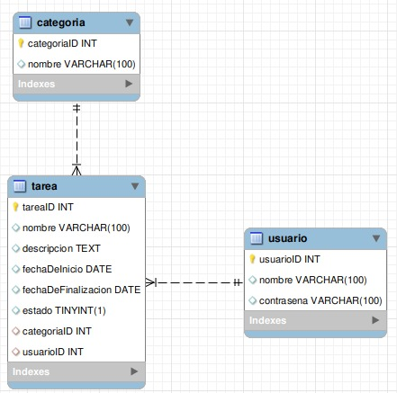

# Gestor de Tareas – Proyecto FullStack (Enfoque Educativo)

**Repositorio:** https://github.com/nicogranillo/finalProyect

---

## 📖 Descripción General

Gestor de Tareas es una **aplicación web full‑stack** que integra:

1. **Frontend**: HTML, CSS (diseño en escala de grises).
2. **Backend**: Java con Spark Java (API REST).
3. **Base de Datos**: MySQL con tablas relacionales y funciones almacenadas.

El objetivo es brindar un recurso educativo donde puedas aprender a coordinar cada capa (frontend, backend y BD) y aplicar buenas prácticas.

---

## 🎯 Enfoque Educativo y Buenas Prácticas

- **Valida siempre** las entradas del usuario tanto en frontend como en backend.
- **Controla errores** y responde con códigos HTTP adecuados (400, 401, 404, 500).
- **Integridad referencial**: las tablas `usuario` y `categoria` están vinculadas a `tarea` mediante claves foráneas.
  - No podrás eliminar un usuario o categoría si existen tareas asociadas.
  - Esto refuerza la consistencia de datos.
- **Funciones almacenadas** en MySQL para encapsular lógica (inserciones, actualizaciones, eliminaciones).
- **Maven** para gestionar dependencias y construir el backend.
- Documenta cualquier cambio de configuración en variables de entorno (.env).

---

## 📂 Estructura del Repositorio

```
finalProyect/
├── backend/             # Código fuente Java + Spark
│   ├── pom.xml          # Configuración Maven
│   └── src/main/java/
│       └── org/gestorTareas/
│           └── TareaAPI.java
│
├── frontend/            # Interfaz web estática
│   ├── index.html       # HTML principal con el css incluido
│   
│
├── database/            # Scripts SQL
│   ├── gestor_tareas.sql     # DDL: tablas y funciones
│   └── datosDePrueba.sql     # INSERTs de ejemplo
│
└── README.md            # Este documento
```

---

## 🧱 Base de Datos MySQL

### Tablas y Relaciones

```sql
CREATE TABLE categoria (
  categoriaID INT AUTO_INCREMENT PRIMARY KEY,
  nombre VARCHAR(100)
);

CREATE TABLE usuario (
  usuarioID INT AUTO_INCREMENT PRIMARY KEY,
  nombre VARCHAR(100),
  contrasena VARCHAR(100)
);

CREATE TABLE tarea (
  tareaID INT AUTO_INCREMENT PRIMARY KEY,
  nombre VARCHAR(100),
  descripcion TEXT,
  fechaDeInicio DATE,
  fechaDeFinalizacion DATE,
  estado BOOLEAN,
  categoriaID INT,
  usuarioID INT,
  FOREIGN KEY (categoriaID) REFERENCES categoria(categoriaID) ON DELETE RESTRICT,
  FOREIGN KEY (usuarioID)   REFERENCES usuario(usuarioID)   ON DELETE RESTRICT
);
```

#### ⚠️ Restricciones Clave

- **ON DELETE RESTRICT** impide eliminar un usuario o categoría si hay tareas vinculadas.
- Esta configuración garantiza que no queden tareas huérfanas.

---

## 🧠 Funciones Almacenadas

En `gestor_tareas.sql` definimos:

| Función                   | Descripción                                          |
|---------------------------|------------------------------------------------------|
| `agregarTarea_DB(...)`    | Inserta nueva tarea y devuelve su ID                 |
| `editarTarea_DB(...)`     | Actualiza campos de una tarea existente              |
| `eliminarTarea_DB(...)`   | Elimina tarea por ID, retorna si tuvo éxito          |
| `verEstadoTarea_DB(...)`  | Consulta estado de tarea por ID                     |
| `marcarEstadoTarea_DB(...)`| Cambia el estado (pendiente/completada)              |
| `agregarCategoria_DB(...)`| Inserta nueva categoría y devuelve su ID             |

> Nota: Adapta las funciones a tu motor MySQL si DML en funciones no es compatible.

---

## ⚙️ Configuración del Entorno

### 1. Base de Datos

1. Inicia MySQL.
2. Abre la terminal o Workbench y ejecuta:
   ```sql
   SOURCE database/gestor_tareas.sql;
   SOURCE database/datosDePrueba.sql;
   ```
3. Si cambias el nombre de la BD o credenciales, actualiza el backend.

### 2. Backend (Java + Spark)

1. Abre **IntelliJ IDEA**.
2. Carga el módulo `backend/` como proyecto Maven.
3. En `pom.xml` revisa dependencias:
   ```xml
   <dependency>
     <groupId>com.sparkjava</groupId>
     <artifactId>spark-core</artifactId>
     <version>2.9.3</version>
   </dependency>
   <dependency>
     <groupId>mysql</groupId>
     <artifactId>mysql-connector-java</artifactId>
     <version>8.0.34</version>
   </dependency>
   ```
4. Modifica la conexión en `TareaAPI.java`:
   ```java
   String url      = "jdbc:mysql://localhost:3306/gestor_tareas";
   String user     = "root";
   String password = "tu_contraseña";
   ```
5. Ejecuta la clase `TareaAPI`.
6. El servidor escuchará en **http://localhost:4567/**

### 3. Frontend

1. Abre `frontend/index.html` en el navegador. O usa Live Server (VSCode).
2. El CSS `css/style.css` ya incluye el diseño en escala de grises y animaciones.
3. El JS `js/app.js` apunta a rutas:
   - `POST /login`  (user: `root`, pass: `Srot405@`)
   - `POST /usuario` / `DELETE /usuario/:id`
   - `POST /categoria` / `DELETE /categoria/:id`
   - `GET /tarea` / `POST /tarea` / `DELETE /tarea/:id`

> **Flujo**: inicias backend → abres `index.html` → haces login → gestionas usuarios, categorías y tareas.

---

## 🧪 Pruebas y Comprobaciones

1. **Control de relaciones**:
   - Crea tarea con usuarioID o categoriaID inexistente → recibe error 500.
   - Elimina usuario con tareas enlazadas → bloqueo por RESTRICT.
2. **Validaciones**:
   - Nombre de usuario/categoría no vacío.
   - Longitudes mínimas.
3. **CRUD Completo**:
   - Agrega → Edita → Elimina cada entidad.

---

## ✍️ Recomendaciones y Extensiones

- Implementar **ON DELETE CASCADE** si prefieres borrar en cascada.
- Añadir autenticación (JWT) y roles (admin, usuario)
- Crear interfaces para seleccionar usuario/categoría en lugar de IDs manuales.
- Migrar a un ORM (Hibernate, JPA).
- Documentar con Swagger o Postman Collections.

---

## 🤝 Contribuciones

¡Contribuciones bienvenidas! Puedes:

- Abrir issues para bugs o sugerencias.
- Hacer fork y PR con mejoras.
- Añadir ejemplos, tests o demos.

---

## 📄 Licencia

Jala License (se ve lindo jeje) © Equipo 2

---

## 🖼️ Diagrama de Entidad-Relación




---


